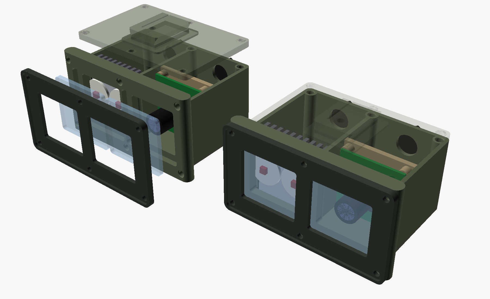

# Mechanical: printed parts, print settings, tolerances, inserts, assembly

Everything here is generated from `hardware/openscad/` by `hardware/scripts/render_all.sh`.
Dimensions quoted below are the model defaults and come from the models' `ECHO` lines.



## 1. Build the files

```bash
sudo apt install openscad xvfb          # OpenSCAD >= 2021.01
hardware/scripts/render_all.sh          # 27 STL + 5 DXF + 6 PNG + mass report, ~80 s
hardware/scripts/render_all.sh --no-png # headless box without OpenGL
```

Outputs:

* `hardware/out/stl/*.stl` and `hardware/out/dxf/*.dxf` (git-ignored)
* `hardware/out/mass_report.md`
* `docs/field/hw-renders/*.png`

The script exits non-zero on any OpenSCAD `WARNING` or `ERROR`, and on any STL that CGAL
does not report as a simple (manifold) solid. To build one part, or one variant:

```bash
cd hardware/openscad
openscad -D 'part="lid"' -D 'shoe_axis="y"' -o pod_lid.stl sensor_pod.scad
openscad -D 'part="mount"' -D 'mount_style="strap"' -o esp32_mount.stl esp32_enclosure.scad
```

Frame convention for every helmet part: X forward, Y left, Z up (the head body frame, FLU),
in mm. It matches `docs/hardware/imu-calibration.md`.

## 2. Parts

| STL / DXF | Qty | Material | What it is |
|---|---|---|---|
| `pod_body` | 1 | ASA | Pod shell: a sealed camera/IMU bay, a vented illuminator bay, a front flange with two window pockets, six bezel inserts, six lid inserts, three PG7 gland holes and a breather hole. 68 × 91.2 × 45.4 mm; the face is 103.2 × 56.4 mm |
| `pod_lid` | 1 | PA-CF | Lid with an integral dovetail shoe (fore-aft insertion) and adjustable gib |
| `pod_lid_shoe_lateral` | (alt) | PA-CF | Same lid with the shoe turned 90°, for receivers that load from the side |
| `pod_bezel` | 1 | ASA | Window retainer with a 1.5 mm bump rim. It hard-stops on the flange, so gasket compression is set by geometry, not by torque |
| `pod_sled` | 1 | PA-CF, 100 % infill | One rigid L-bracket carrying both the camera board (4 × M2) and the BNO085 (4 × M2). Two slotted M3 screws from below the floor give ±4 mm of focus travel |
| `pod_window_cam_3mm_pc.dxf`, `pod_window_ir_3mm_pc.dxf` | 1 + 1 (+ spares) | 3 mm polycarbonate | 42 × 38 mm windows with r = 2 mm corners |
| `pod_gasket_1mm_neoprene_x2.dxf` | 2 | 1 mm closed-cell neoprene/EPDM, black, adhesive one side | 3 mm-wide ring that seals the window and also acts as the optical baffle |
| `pod_ir_diffuser_film.dxf` | 1 | 60° holographic diffuser film | 36 × 32 mm, under the IR window |
| `pod_led_plate_2mm_al.dxf` | 1 | 2 mm 5052/6061 aluminium | 43.6 × 42.5 mm plate that slides into grooves. It carries the two LED stars on the front and the 40 × 40 × 11 heatsink on the back |
| `esp32_base` / `esp32_base_devkitc` | 1 | ASA | Box for an ESP32-S3-DevKitC-1 (default) or ESP32-DevKitC on a 70 × 30 perfboard. Connector bays at both ends; 108.8 × 40.8 × 26.6 mm |
| `esp32_lid` / `esp32_lid_devkitc` | 1 | ASA | Lid with a locating lip, the USB-exit tongue and an engraved firmware env |
| `esp32_mount` / `esp32_mount_strap` | 1 | PA-CF | Plate bolted under the box: a MIL-STD-1913 clamp (for an ARC-to-Picatinny adapter), or wings with 25 mm webbing slots |
| `esp32_jaw` | 1 | PA-CF | Moving jaw for the Picatinny clamp (2 × M3 × 30 cross-bolts sit in recoil grooves) |
| `esp32_grommet` | 1 | TPU 95A | Split grommet for the USB cable at the lid seam |
| `rear_base` | 1 | PETG | Curved (R 115 mm) helmet plate: hook-and-loop land, 2 × 25 mm webbing slots, two female dovetail grooves, thumb-screw insert |
| `rear_cassette` | 1 | ASA | Jetson bay (104 × 83 mm, I/O edge facing down) plus power bay (34 × 83 mm). Lid columns, PD-trigger cradle, GX12-2 socket, tie slots |
| `rear_rail` | 2 | PA-CF | Male dovetail rails, screwed under the cassette (2 × M2.5 × 8 countersunk each) |
| `rear_lid` | 1 | ASA | Fan-intake grille, toggle hole with a guard ring, "IR SAFE / ARM" engraving |
| `cable_rail_clip` | 2–4 | TPU 95A | Snaps onto a 1913 rail; channel for the 4 mm switch cable |
| `cable_strap_clip` | 2 | PETG or TPU | Pushes onto 25 mm webbing; press-in cable channel |
| `cable_helmet_saddle` | 3 | PETG | Hook-and-loop-backed saddle: USB, IR pair and HDMI ribbon side by side |
| `cable_plug_boot` | 1 | TPU 95A | Boot over the 3.5 mm plug/cable joint |
| `coupon_*` | 1 each | as the real part | Fit coupons: dovetail gauge (−0.2/0/+0.2), insert holes, window pocket + bezel, rail clamp + jaw |

## 3. Materials and print settings

0.4 mm nozzle, 0.2 mm layers (0.16 mm for the shoe and rails). Every part is oriented in its
STL so it prints **without supports**. The only exception is `rear_base`, which prints on its
end (see the table).

| Part | Material | Why this material | Orientation (as exported unless noted) | Walls | Top/bottom | Infill | Notes |
|---|---|---|---|---|---|---|---|
| pod body | **ASA** (alt: PETG in cool climates) | UV-stable, HDT ~95 °C (a dark pod in sun reaches 60 °C+; PETG creeps), good impact | floor down. A 45° wedge supports the flange's bottom lip | 5 (2.4 mm walls print solid) | 5 / 5 | 30 % gyroid | enclosure on, draft shield. Anneal not needed |
| pod lid (shoe) | **PA-CF** (PA6-CF / PA12-CF) | stiff, wear-resistant dovetail; holds the gib flexure | flat, shoe up. Dovetail flanks are 30° from vertical | 6 | 6 / 6 | 60 % | dry the filament (80 °C, 8 h). Hardened nozzle |
| pod bezel | ASA | | back face on the bed | 4 | solid | 100 % | bed flatness matters: it seals |
| pod sled | **PA-CF** (alt: PETG) | rigidity: camera ↔ IMU boresight | foot on the bed | 6 | solid | **100 %** | any flex here shows up as boresight error |
| ESP32 base, lid | ASA | | base floor down; lid top face down | 4 | 5 / 5 | 25 % | |
| ESP32 mount, jaw | PA-CF | clamp loads, rail wear | mount clamp up; jaw on its outer face | 6 | solid | 100 % | |
| rear cassette, lid | ASA | heat (Jetson exhaust), UV | cassette floor down; lid as exported (top up) | 4 | 5 / 5 | 25 % | 145 mm long: enclosure needed against warp |
| rear rails | PA-CF | sliding wear | wide face down | solid | – | 100 % | 0.16 mm layers |
| rear base | PETG (alt: ASA) | some flex to match the shell; touches the helmet only | **stand it on its −Y (bottom) end**: the curve is then an extrusion with no overhang | 4 | 5 / 5 | 30 % | 5 mm brim (108 mm tall) |
| TPU parts | TPU 95A | elastic snap / seal | as exported | 3 | 3 / 3 | 30–50 % | 20–30 mm/s |
| strap clip, saddles | PETG | | on their end (as exported) | 4 | – | 40 % | |

Colour: use dark tan, grey or black (`RAL 7013`/`8027`-ish) and **matte** surfaces. Shiny
prints reflect torchlight and NIR.

## 4. Tolerances (`lynx_common.scad`)

| Constant | Value | Use |
|---|---|---|
| `CLR_SLIDE` | 0.20 mm / side | sled in bay, LED plate in grooves, jaw, rails in grooves (+0.05) |
| `CLR_LOOSE` | 0.35 mm / side | windows in pockets, boards in bays |
| `CLR_PRESS` | 0.05 mm / side | press fits (none in the default build) |
| `HOLE_COMP` | +0.20 mm on Ø | every printed round hole (FDM holes print undersize) |
| `DT_FIT` | 0.0 mm | dovetail width trim from the gauge coupon |

Print `fit_coupons.scad` in the production material and on the production printer first:

1. **`coupon_insert_coupon`**: rows M2 / M2.5 / M3, columns −0.1 / 0 / +0.1 mm. Use the
   column where the insert goes in flush, does not spin under a 0.5 N·m screw, and does not
   bulge the outside wall. Write that diameter into `INSERT_*[0]`.
2. **`coupon_rail_coupon` + `coupon_rail_jaw`**: on your rail adapter. It must slide on with
   the bolts loose and lock solid when they are tightened.
3. **`coupon_window_coupon` + `coupon_window_bezel`**: with a real Lexan window and gasket.
   With the bezel screwed down, the window must not rattle, and light must not show around
   the gasket when you shine a torch from behind.
4. **`coupon_dovetail_gauge`** (see §6).

## 5. Heat-set inserts and fasteners

Pattern: brass, knurled, tapered (ruthex / CNC Kitchen type).

| Insert | Hole Ø × depth (model) | Where |
|---|---|---|
| M2 × 4 | 3.2 × 4.5 (+1 mm melt relief) | camera standoffs (4), BNO standoffs (4), ESP32 carrier standoffs (4), PDB standoffs (4) |
| M2.5 × 4 | 3.6 × 5.0 | Jetson standoffs (4), rail screws (4) |
| M3 × 5.7 | 4.0 × 6.5 | pod bezel (6), pod lid (6), sled foot (2, from below), shoe gib (1), ESP32 lid (4), cassette lid (6), base thumb screw (1) |

Installation:

* Iron tip 220–235 °C for PETG/ASA and 260–270 °C for PA-CF.
* Press straight down and stop 0.2 mm proud.
* Flatten flush with the iron off a flat plate, then let it cool for 30 s.
* Never use threadlocker anywhere near polycarbonate (environmental stress cracking). Use
  nylon-patch screws or Vibra-Tite VC-3 if anything vibrates loose.

| Joint | Fastener | Torque |
|---|---|---|
| bezel → flange (6), pod lid (6), ESP32 lid (4), cassette lid (6) | M3 × 8 ISO 7380 button (pod lid: M3 × 10) | 0.4 N·m (the bezel hard-stops; do not go past it) |
| sled → floor (2) | M3 × 10 ISO 4762 + rubber/nylon washer (seals the slot) | 0.5 N·m |
| camera board, BNO085, ESP32 carrier, PDB | M2 × 5 | 0.15 N·m |
| Jetson carrier (4) | M2.5 × 6 (check your carrier's holes; M3 × 6 if they measure ≥ 3.2 mm) | 0.25 N·m |
| rails → cassette (4) | M2.5 × 8 ISO 10642 countersunk | 0.3 N·m |
| ESP32 mount → box (4) | M3 × 8 + M3 nut in trap | 0.5 N·m |
| Picatinny cross-bolts (2) | M3 × 30 ISO 4762 + DIN 985 nyloc | 0.8 N·m |
| cassette → base (1) | M3 × 10 knurled thumb screw (DIN 464) | finger tight |
| shoe gib (1) | M3 × 6 cone-point set screw | see §6 |

## 6. Dovetail shoe: fitting it to your mount

No dimensional standard for the NVG dovetail is published. Wilcox G24/L4 and the repro mounts
that copy them differ by tenths of a millimetre. The shoe in `lynx_common.scad` is therefore
parametric:

| Parameter | Default | Meaning |
|---|---|---|
| `DT_W_TOP` | 24.0 | widest width (at the top face) |
| `DT_H` | 5.0 | dovetail height |
| `DT_ANGLE` | 60° | flank angle from the base. The neck is then 18.2 mm |
| `DT_LEN` | 30.0 | length along the insertion axis |
| `DT_RISER` | 3.0 | plain riser under the dovetail |
| `DT_LATCH_D`, `DT_LATCH_DEPTH`, `DT_LATCH_POS` | 4.2, 2.5, 9.0 | blind detent hole for the receiver's spring latch, measured from the leading end |
| `shoe_axis` (pod) | `"x"` | `"x"` = slides in fore-aft; `"y"` = slides in from the side |

Procedure:

1. Measure your receiver with calipers: the slot width at the opening, the slot depth, and
   the distance from the slot mouth to the latch pin when the latch is pressed.
2. Set `DT_W_TOP`, `DT_H`, `DT_LATCH_POS` and `shoe_axis`. Print `coupon_dovetail_gauge`:
   three shoes at −0.2 / 0 / +0.2 mm, marked by 1 / 2 / 3 notches.
3. Pick the one that clicks in with light hand force and does not rock. Set `DT_FIT` to its
   value and re-render `pod_lid`.
4. On the real lid, the M3 set screw in the side of the shoe pushes a 1.2 mm flexure flank
   outward, taking up the last 0–0.6 mm. Back it out, insert the pod until it clicks, then
   turn the screw in until all rocking stops, plus 1/8 turn. Witness-mark it with a paint pen.
5. Pull test: the pod must hold a 5 kg pull along the insertion axis with the latch engaged.
   It must still release with one hand on the mount's button.

The shoe is PA-CF. Inspect the latch detent for wear at every maintenance check
([hw-maintenance.md](hw-maintenance.md)); reprint the lid when the detent edge is rounded.

## 7. Sensor pod assembly

Layout (X forward, Y left):

* The camera bay is on +Y (the wearer's left) and the illuminator bay is on −Y.
* The optical axis is 23.9 mm above the floor, which centres it on both windows.
* The camera lens front sits 1.5 mm behind the window's inner face (x = 63.5 vs 65.0 mm).
* The LED domes sit 3.5 mm behind the IR window.

1. **Inserts.** Body: 6 in the flange face, 6 in the lid columns. Sled: 4 × M2 in the camera
   standoffs, 4 × M2 in the BNO standoffs, 2 × M3 from below. Lid: 1 × M3 (gib).
2. **Windows.** Cut two 42 × 38 mm pieces from 3.0 mm clear polycarbonate (Makrolon GP /
   Lexan 9034, *uncoated or hard-coated only*; no IR-blocking, tinted or anti-fog coatings).
   Use the DXF on a CNC router or waterjet, or print it 1:1 as a paper template, saw with a
   fine-tooth blade and file the r = 2 mm corners.
   * **Do not laser-cut polycarbonate.** It chars, the edges stress-crack, and the fumes are
     hazardous.
   * Deburr the edges.
   * Leave the protective film on until final assembly.
3. **NIR check.** Put the camera behind a window at 850 nm (illuminator on, dim room). Mean
   pixel value must be ≥ 80 % of the no-window value at the same exposure. If not, the sheet
   has an IR-blocking coating; use another sheet.
4. **Gaskets.** Stick a gasket ring (DXF, 1 mm black closed-cell neoprene) onto each pocket
   land, adhesive side down. For the IR window, lay the diffuser film in the pocket first,
   under the gasket.
5. **Illuminator.** Bond the two SFH 4715AS stars to the aluminium plate with thermal
   adhesive tape (3M 8810), 21 mm apart, centred on the IR window. Bond the 40 × 40 × 11
   heatsink, fins vertical, to the back.
   * Wire the LEDs **in series**: + → LED1 → LED2 → −.
   * Use 22 AWG silicone twisted pair through gland G3.
   * Slide the plate into its grooves.
6. **Sled.** Mount the BNO085 on the foot: components up, its **X arrow pointing forward
   (+X)**. That is the `top-flat` / `FLU` mount spec (imu-calibration.md), so no extra mount
   rotation is needed.
   * Solder the 6-core shielded pigtail to VIN/3V3, GND, SDA, SCL, INT and RST. Put C1
     (100 nF) and C2 (10 µF) at the BNO end (wiring.md §2). Leave the shield **floating at
     this end** and insulate it.
   * Mount the camera board, lens forward (4 × M2 × 5). Its USB lead goes back through the
     plate's cut-out.
   * Drop the sled into the camera bay, then fit the 2 × M3 × 10 from below with sealing
     washers, finger tight.
7. **Glands and breather.**
   * G1 (upper, camera bay): camera USB.
   * G2 (lower, camera bay): IMU 6-core.
   * G3 (IR bay): LED pair.
   * Stick the ePTFE breather inside over the Ø 6 mm hole. Drop a 1 g silica-gel sachet into
     the camera bay.
8. **Focus.** Fit the windows and bezel (6 × M3 × 8 until the bezel bottoms) and put the lid
   on loosely.
   * Stream the camera, slide the sled for the lens length, and focus the M12 lens at 5 m
     through the window.
   * Lock the lens with its set screw, then tighten the sled screws (0.5 N·m).
   * Paint-pen witness marks across the sled screws and the lens ring: they are the boresight
     record.
9. **Lid.** Lay 1 mm foam tape on the top edges of the camera bay walls, then fit the lid
   (6 × M3 × 10).
10. **Pigtail ends.** Camera USB: 0.9 m to a USB-A plug. IMU: 0.35 m to a GX12-6 plug P2.
    IR: 0.9 m to a GX12-2 plug P3. Pinouts are in
    [hw-compute-power.md §6](hw-compute-power.md#6-connectors-and-pinouts).
11. **Calibrate.** Boresight and mount calibration per `docs/hardware/imu-calibration.md`. Mount
    spec `FLU` (top-flat); the pod's X axis is the camera's optical axis by construction.

Seal level: the camera bay is roughly IP54 (gasketed window and lid, glands, breather). The IR
bay is deliberately vented (floor slots in, side slots out, chimney flow over the fins) and is
splash-resistant only.

## 8. ESP32 enclosure assembly

Fitted on the **left** side rail. Local X is fore-aft, the lid faces outward, and local +Y
faces down, so J1 points at the ground.

1. Inserts: 4 × M3 in the corner columns, 4 × M2 in the carrier standoffs.
2. Build the carrier on a 70 × 30 mm perfboard: two 2 × 22 female header rows at 25.4 mm
   spacing, plus R1/R2 (2.2 kΩ I2C pull-ups), R3 (10 kΩ), R4 (100 Ω), C3 (100 nF) and D1
   (PESD5V0S1BL), exactly as in `docs/hardware/wiring.md` §2–3.
3. Panel parts:
   * J2 (GX12-6 socket) goes in the +X end. Wire it to the carrier: 3V3, GND, SDA, SCL, INT,
     RST. Drain the pigtail shield to GND **here** (one end only).
   * J1 (3.5 mm TRS panel jack, M6) goes in the +Y wall of the rear bay: tip → R4 → GPIO,
     sleeve and ring → GND.
4. Plug in the DevKit with its USB end toward −X.
   * Route the USB cable through the split TPU grommet into the notch at the −X end.
   * Tie J1's leads and the USB cable to the anchor bar with one cable tie.
5. Bolt the mount plate under the box: 4 × M3 × 8 from inside the end bays, nuts in the
   traps. Fit the jaw and its 2 × M3 × 30 cross-bolts. Clamp it to an ARC-to-Picatinny
   adapter on the left rail, or use the strap variant and hook-and-loop.
6. Lid on (4 × M3 × 8). The status LED stays inside: no light leaks from the helmet
   (light discipline). Look at it with the lid off during bench checks.

## 9. Rear cassette assembly

Local X runs across the back of the helmet, local Y up, and local Z outward. The Jetson I/O
edge faces down.

1. Inserts:
   * cassette: 6 × M3 (lid), 4 × M2.5 (Jetson), 4 × M2.5 from below (rails), 4 × M2 (PDB)
   * base: 1 × M3 (thumb screw)
2. Screw the two rails under the cassette (M2.5 × 8 countersunk).
3. **Measure your carrier's mounting holes** before trusting `jet_holes = [86, 58]` (the
   Jetson Nano / Orin Nano developer-kit pattern). Change it and re-render if it differs.
   Mount the dev kit I/O-edge-down on 5 mm standoffs.
4. Build the PDB on the 70 × 30 mm perfboard per
   [hw-compute-power.md §5](hw-compute-power.md#5-power-distribution-board-pdb-and-ir-interlock).
   * Slide the CH224K PD-trigger board into the cradle, receptacle out through the cut-out.
   * Stack a 5 mm EVA pad on it.
   * Screw the PDB down on its 10 mm standoffs: the PDB clamps the trigger board.
5. Route the 20 AWG DC lead through the divider pass-through and under the carrier edge to
   the barrel jack. Tie the plug down through the first floor tie-slot pair; move `tie_x` if
   your jack sits elsewhere. Tie each USB-A / DP plug through the other slot pairs.
6. Toggle S1 goes in the lid with its guard ring. Panel socket J11 (GX12-2) goes in the
   bottom wall.
7. Base: a 6 mm EVA pad on the curved underside, then adhesive hook-and-loop. Press it onto
   the rear loop panel. Pass a 25 mm strap through both wing slots and around to the side
   rails (ARC strap anchors) or the rear bungee, and tension it.
8. Slide the cassette down onto the base until it stops, then fit the thumb screw.

## 10. Cable management

* **Rail switch.** Pressure pad on the handguard. Then 2–4 TPU rail clips along the rail,
  one strap clip at the sling or shoulder strap, and one strap clip at the plate-carrier
  shoulder. From there it runs up the left side of the helmet to J1, with the plug boot on
  the plug.
  * Leave 15 cm of slack between the shoulder clip and J1 so head rotation never loads the
    plug.
  * The plug pulling out of J1 is the breakaway.
* **Helmet harness.**
  * The pod pigtails leave the pod's rear glands and take a **60 mm service loop** over the
    mount, for flip-up and fore-aft travel.
  * Anchor them to the shroud with a hook-and-loop wrap.
  * Then 3 × `cable_helmet_saddle` along the left of the crown carry USB, IR and (on the
    right side) the HDMI ribbon to the rear cassette.
  * The IMU pigtail drops to J2 on the ESP32 box.
* Use braided sleeving 6 mm over the pod-to-rear bundle. Never tie cables to the mount's
  moving arm.
