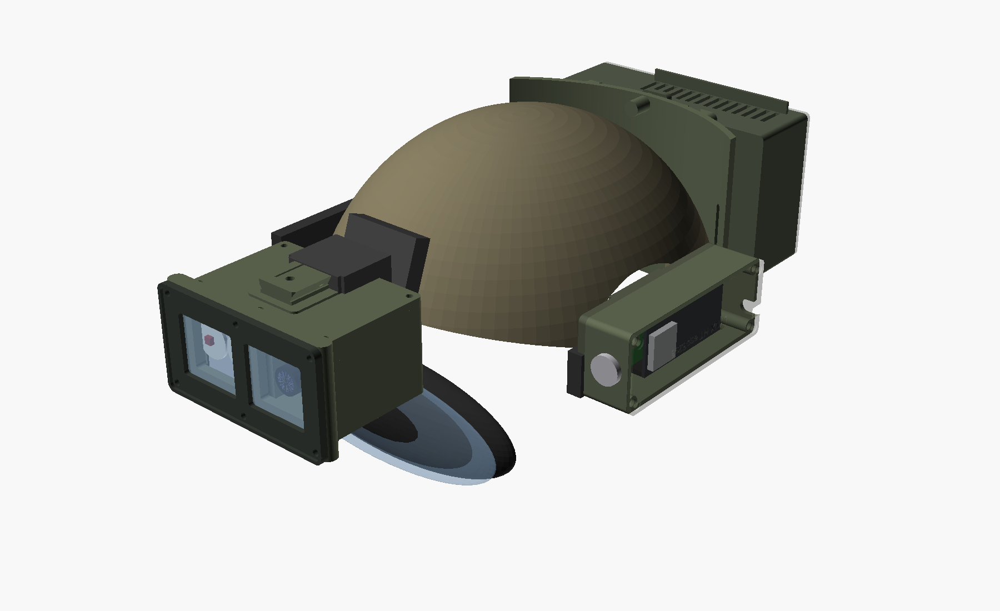

# Weight and balance

Printed-part masses come from the actual STL volumes. `hardware/scripts/mass_report.py` sums
them with filament density × an effective fill factor for the print settings in
[hw-mechanical.md](hw-mechanical.md) §3. COTS masses are datasheet or scale values.
Positions are part CGs in the head frame:

* origin at the head+helmet CG
* X forward, Y left, Z up, mm
* pod deployed

The numbers below are from `render_all.sh` on the default parameters. Re-run it after any
model change and copy the new totals here.

## 1. Head-borne mass

| Group | Mass (g) | CG x, y, z (mm) | Pitch moment (N·m, + = nose-down) | Roll moment (N·m, + = left-down) |
|---|---:|---|---:|---:|
| Sensor pod: printed 111 g (body 64, lid 29, bezel 10, sled 9) + camera, BNO085, LEDs, plate, heatsink, windows, glands, fasteners 82 g | **194** | 150, 0, 46 | +0.285 | 0 |
| NVG mount (Wilcox G24 162 g; repro mounts 110–150 g) | 162 | 120, 0, 58 | +0.191 | 0 |
| One-hole shroud (0 if already fitted) | 35 | 105, 0, 55 | +0.036 | 0 |
| ESP32 box: printed 58 g + DevKit, carrier, GX12, jack 34 g | 92 | 20, 115, 40 | +0.018 | +0.104 |
| Rear cassette: printed 106 g + Jetson 176 g + PDB / sockets / toggle 38 g | 320 | −148, 0, 40 | −0.464 | 0 |
| Rear base: printed 72 g + EVA, hook-and-loop, strap 25 g | 97 | −120, 0, 40 | −0.114 | 0 |
| Display engine (inside the goggle) | 22 | 88, −32, −10 | +0.019 | −0.007 |
| Display driver board (strap clip) | 14 | 50, −80, −5 | +0.007 | −0.011 |
| Harness (USB × 2, IR pair, HDMI ribbon, DP adapter, sleeving, 3 saddles) | 107 | −10, 20, 75 | −0.010 | +0.021 |
| **Total added** | **1042** | **−3.2, 10.4, 46.4** | **−0.033** | **+0.107** |

* **Pitch.** The front group (pod + mount + shroud, 391 g) makes +0.51 N·m and the rear group
  (cassette + base, 416 g) makes −0.58 N·m. The added CG sits 3 mm behind the head CG, which
  is statically balanced in pitch. **The Jetson is the counterweight.** None of its mass is
  dead weight.
* **Roll.** +0.11 N·m left-down, from the ESP32 box on the left rail. That is the same as a
  10 g mass 1.1 m out: not noticeable. Moving the display driver to the right strap already
  offsets some of it.
* **Comparison.** A PVS-14 setup (≈ 350 g tube + 160 g mount + 30 g shroud + 300–450 g
  counterweight) is 0.85–1.0 kg. This build is in the same class, and all of its mass is
  functional.

## 2. Sensitivities and alternatives

| Change | Effect |
|---|---|
| Pod 10 mm further forward (mount fore/aft travel) | +0.019 N·m. The full 33 mm G24 travel is ±0.06 N·m |
| Jetson body-worn (umbilical: 2 × USB, HDMI, IR, power) | helmet adds 626 g but is +0.55 N·m nose-down. Balancing it needs ~400 g of dead counterweight at x = −140 mm, giving ~1.03 kg, the same mass with a 1.5 m umbilical to snag. **Rejected** |
| Repro mount (~120 g) instead of G24 | −42 g, −0.05 N·m |
| PETG instead of ASA for the pod body | +12 g (denser) |
| Bank in the rear pouch instead of on the body (helmet-only config) | +~550 g at x ≈ −150: −0.8 N·m tail-heavy. **Not recommended**. The bank stays on the body |

## 3. Fitting procedure

1. Fit everything. Set the mount to the operating position, pod down.
2. Static check: hold the helmet by the chinstrap buckles (roughly the ear axis). It must hang
   level within ±10°. Tail-down: slide the pod forward on the mount, or move the cassette up
   (base strap slots). Nose-down: the reverse.
3. Dynamic check: 10 min of walking and quick 90° head turns. The helmet must not rotate on
   the head with the retention system at normal tension. If it does, tighten the nape dial
   before adding anything.
4. Stowed (pod flipped up): CG moves up and back. Expected and fine; the IR interlock turns
   off the illuminator.
