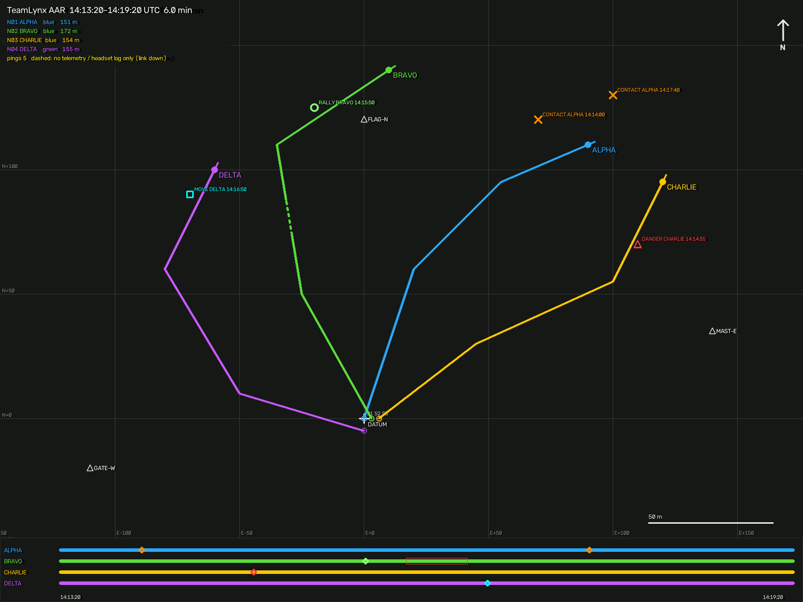

# Deployment: Jetson setup, services, field launcher, logging and replay

This doc goes from a fresh JetPack install to a squad on the field, and from the session logs to
an after-action review. The network side is in [net-network.md](net-network.md).

## 1. Prepare (at home, with internet)

```bash
pip install -e ".[field,dev]"                                   # laptop: lynx-field
cp deploy/squad.example.json squad.json                         # edit SSID, passphrase, country, MACs
lynx-field netconfig squad.json --out build/net                 # router script + node profiles
deploy/openwrt/install-relay.sh root@192.168.8.1 build/net/router/lynx-router-setup.sh
```

Then, on each Jetson, from a checkout of this repository:

```bash
sudo deploy/jetson/setup.sh --profile build/net/nodes/lynx-n03.json --site site.json \
     --ssid LYNX-SQUAD --psk 'your-squad-passphrase'
sudo deploy/jetson/setup.sh --profile build/net/nodes/lynx-n01.json --site site.json \
     --ssid LYNX-SQUAD --psk 'your-squad-passphrase' --leader          # the squad leader
deploy/jetson/setup.sh ... --dry-run                                     # print every action
```

[`setup.sh`](../../deploy/jetson/setup.sh) is idempotent, so re-run it after `git pull`. It
does the following:

| Step | Result |
|---|---|
| apt | `python3-venv`, `chrony`, `avahi-daemon`, `network-manager`, `v4l-utils`, `rsync` |
| code | `/opt/lynx/src` (rsync of the checkout), venv `/opt/lynx/venv` with `--system-site-packages`, so JetPack's CUDA OpenCV is used. It never pip-installs opencv. `pip install -e .[hw,field] scipy` |
| config | `/etc/lynx/node.json` (profile), `/etc/lynx/site.json`, `/var/lib/lynx` (calibration), `/var/log/lynx` (logs); the user is added to `dialout`, `video` |
| udev | [`99-lynx.rules`](../../deploy/udev/99-lynx.rules): `/dev/lynx-imu` (CP210x / CH340 / CH9102 / ESP32-S3), `/dev/lynx-gnss` (u-blox), ModemManager kept off both |
| Wi-Fi | NetworkManager profile `lynx`: WPA3-SAE, PMF required, power save off, autoconnect priority 100 |
| time | chrony: the leader serves `local stratum 8`, and the others follow `relay2.lynx` (then `relay.lynx`) |
| services | `lynx-headset.service` everywhere. On the leader also `lynx-relay.service` (secondary, bridged, logging) and the avahi service file |
| `--max-perf` | `nvpmodel -m 0` and `jetson_clocks` |

Node profile ([generated](../../deploy/example/nodes/lynx-n01.json), loaded by `NodeProfile`):

| key | meaning |
|---|---|
| `node`, `callsign`, `team`, `squad` | identity on the wire; `squad` filters discovery |
| `relay_urls`, `discovery` | explicit relays (optional), then beacon / mDNS / DNS / gateway |
| `imu`, `gnss` | `/dev/lynx-imu`, optional `/dev/lynx-gnss` (`mock://` for the bench); `imu: null` uses the keyboard |
| `site`, `cal_dir`, `log_dir` | site file, calibration directory, session-log directory (`null` = no log) |
| `calibrate`, `calibrate_max_age_h` | `always` / `if-missing` / `if-stale` / `never`, and the staleness age |
| `station`, `markers` | where this operator tares (default: the first station, up to 3 markers) |
| `camera` | `source` (`0`, a path, or `synthetic`), `hfov`, `width`, `height` |
| `telemetry_hz`, `imu_report` | telemetry rate; `rv` / `grv` (sets the drift prior) |
| `headset_args` | extra `lynx-headset` arguments |

## 2. Services

| Unit | Runs | Notes |
|---|---|---|
| [`lynx-headset.service`](../../deploy/systemd/lynx-headset.service) | `lynx-field headset --profile /etc/lynx/node.json` | `Type=notify`, `WatchdogSec=10`, `Restart=always`. `DISPLAY=:0` as the desktop user (the helmet micro-display is the desktop). `TimeoutStartSec=15min` covers calibration |
| [`lynx-relay.service`](../../deploy/systemd/lynx-relay.service) | `lynx-field relay $LYNX_RELAY_ARGS` | leader only; args in `/etc/lynx/relay.env`: `--role secondary --priority 10 --upstream ws://relay.lynx:8765 --log /var/log/lynx --log-gz` |
| [`lynx-recorder.service`](../../deploy/systemd/lynx-recorder.service) | `lynx-field record --out /var/log/lynx --gz` | installed but not enabled. Only needed without a leader relay: a passive observer that logs everything the relay fans out |
| router `/etc/init.d/lynx-relay` | `python3 -m lynx.field relay --role primary ...` | procd, respawn forever; `uci set lynx.relay.log=/mnt/sda1/lynx` to log to a USB stick |

```bash
sudo systemctl start lynx-headset lynx-relay
journalctl -fu lynx-headset
lynx-field headset --profile /etc/lynx/node.json --dry-run     # resolved relays, calibration, argv as JSON
lynx-field discover                                            # what answers on the LAN
```

## 3. Field launcher (`lynx-field headset`)

On power-up, with no input other than the rail switch:

1. **Calibrate** if the profile says so. The staging prompt appears on the helmet display, and the
   operator taps the rail switch on each marker ([net-calibration.md](net-calibration.md)). A
   failed calibration is logged and the HUD starts with the previous calibration, or none: a
   calibration problem must never keep the HUD from starting.
2. **Resolve relays**: profile URLs, then discovery. If nothing answers, `ws://relay.lynx:8765`
   is the fallback, and discovery is re-run whenever a failover cycle fails.
3. **Pose source**: `gnss:IMU?gnss=..&site=..&cal=..` if the profile has a GNSS port and the site
   has a datum; otherwise `serial:IMU?cal=/var/lib/lynx/imu.json` at the calibrated position.
4. **Run** `HeadsetClient` on a `FailoverClient` with the field hook. The hook adds friendly
   holdover on link loss, drift and GNSS alerts, the session log (own pose at 5 Hz, own pings,
   link events) and the systemd watchdog.

## 4. Session logging

* **Relay log** (leader's secondary relay, or router with a USB stick): every message the relay
  accepted and fanned out. Telemetry is decimated to 5 Hz per node, and pings, cancels and leaves
  are always written. Through the bridge the secondary sees the whole squad.
* **Headset log** (`/var/log/lynx/node-N-*.jsonl`): that headset's own pose, link state, own pings
  and link events. It covers what the relay never saw while that headset was out of range.
* The format is JSON Lines, optionally gzip, one record per line, flushed at least once a second.
  Readers skip a truncated tail after a power cut. Ten nodes at 5 Hz is about 10 KB/s, or
  36 MB/h before gzip.
* All hosts follow the leader's clock (chrony), so logs merge on wall time. For a host that was
  off, `replay --offset node:3=-2.5` corrects it.

Collect after the game:

```bash
rsync -a lynx-n01.lynx:/var/log/lynx/ logs/   # leader (relay log)
for n in 02 03 04; do rsync -a lynx-n$n.lynx:/var/log/lynx/ logs/; done
```

## 5. After-action review (`lynx-field replay`)

```bash
lynx-field replay logs/ --site site.json --out aar.png                       # overview + text summary
lynx-field replay logs/ --site site.json --out aar.png --video aar.mp4 --speed 10
```



The example above is a scripted 6-minute, 4-node session (relay log + one headset log), rendered
by the code in this PR. The overview is north-up in the site frame and shows:

* a grid with metre labels, the datum, stations and markers;
* one colour per node, with start ring, end dot, heading tick and distance travelled;
* **dashed track where the relay had no telemetry** and only the headset's own log covers it. In
  the example, BRAVO was out of range for 30 s;
* pings by type (✕ contact, △ danger, ○ rally, □ move, ◇ mark) with owner and clock time;
* a timeline per node: telemetry coverage, link-down intervals (red boxes) and pings.

The video replays positions with 60 s trails, active pings at each moment, and stale nodes
(no fix for > 2 s) hollow with their age. The text summary lists per-node points, distance and
longest gap, pings by type, and link-down time per headset.

## 6. Bench run (no hardware)

```bash
lynx-field relay --log /tmp/lynx-bench/logs --no-beacon                    # terminal 1
lynx-field calibrate --site deploy/lynx/site.example.json --imu mock://still --station S1 \
    --marker FLAG-N --out /tmp/lynx-bench/cal --node 2 --keyboard          # terminal 2: press Enter
lynx-headset --node 1 --callsign ALPHA --y 30 --heading 180 --pitch -8     # terminal 3 (space = ping)
lynx-field headset --profile deploy/lynx/node.bench.json                    # terminal 4: mock IMU, synthetic camera
lynx-field replay /tmp/lynx-bench/logs --site deploy/lynx/site.example.json --out /tmp/aar.png
```

Add `--headless --frames 150` to the headset commands to run without windows.

## 7. Game-day checklist

1. Router on its power bank. `lynx-field discover` from any headset shows the primary, and the
   leader's secondary once it is up.
2. `lynx-field loadtest --url ws://192.168.8.1:8765 --nodes 10 --duration 10` from a laptop on the
   SSID: 0 ping loss, p99 below about 60 ms, router CPU acceptable in `top`
   ([net-loadtest.md](net-loadtest.md)).
3. Each operator: power on and tap the markers at the staging station.
4. Walk-off check: each operator faces a marker and confirms the reticle sits on it, or runs
   `lynx-field calibrate --check FLAG-N`.
5. During the game, re-tare when the HUD shows `RE-TARE`.
6. After the game, collect logs and run `lynx-field replay`.
